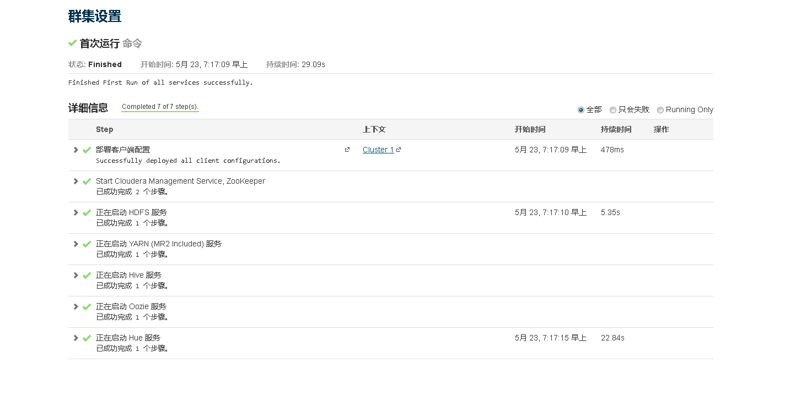

#CDH5.5环境搭建

##（一）	简介
####     CDH is the most complete, tested, and popular distribution of Apache Hadoop and related projects. CDH delivers the core elements of Hadoop – scalable storage and distributed computing – along with a Web-based user interface and vital enterprise capabilities. CDH is Apache-licensed open source and is the only Hadoop solution to offer unified batch processing, interactive SQL and interactive search, and role-based access controls 
  
##（二）	系统要求以及版本支持  
###1 操作系统的要求（与RHEL兼容系列）
####<table border="1">
   <tr>
      <th colspan="4">Red Hat Enterprise Linux and CentOS, 64-bit</th>
   </tr>
   <tr>
      <td>5.10</td>
      <td>5.7</td>
      <td>6.4</td>
      <td>6.5</td>
   </tr>
   <tr>
      <td>6.5 in SE Linux mode</td>
      <td>6.6</td>
      <td>6.6 in SE Linux mode</td>
      <td>6.7</td>
   </tr>
</table>  
######*&ensp;&ensp;&ensp;&ensp;<font color=red>注意：</font>*a&ensp;如果是RHEL7系列，只支持7.1版本，不支持7.0   
######&ensp;&ensp;&ensp;&ensp;&ensp;&ensp;&ensp;&ensp;&ensp;&ensp;b&ensp;RHEL7.1版本必须是新安装，从低版本升级到7.1是不允许的。  
###2 JDK版本的要求
####<table>
   <tr>
      <td>CDH Version Managed</td>
      <td>Minimum Supported JDK Version</td>
      <td>Recommended JDK Version</td>
   </tr>
   <tr>
      <td rowspan="2">CDH 5</td>
      <td>1.7.0_55</td>
      <td>1.7.0_67 1.7.0_75 1.7.0_80</td>
   </tr>
   <tr>
      <td>1.8.0_31 官方不建议使用1.8.0_40</td>
      <td>1.8.0_60</td>
   </tr>
</table>
###3 浏览器的支持（浏览器是管理员用来安装、配置、管理以及监控服务的交互工具）
 <ul>
<li><p>火狐（24和31）</p></li>
<li><p>Google Chrome(36及更高版本）</p></li>
<li><p>IE（9及更高）</p></li>
<li><p>Safari（5及更高）</p></li>    
</ul> 
###4 对数据库的支持([详见官网](http://www.cloudera.com/documentation/enterprise/5-5-x/topics/cdh_ig_req_supported_versions.html#topic_2))
####&ensp;&ensp;&ensp;&ensp;CM支持多种数据库，关于服务的配置、角色的分配、配置的历史记录以及正在运行的程序等等，Cloudera Manager Server将这些信息都存储在自己的数据库中。  
<table><tr><td>MariaDB 5.5</td><td>MySQL - 5.1, 5.5 and 5.6</td><td>Oracle 11gR2 and 12c </td><td>PostgreSQL - 8.1, 8.3, 8.4, 9.1, 9.2, 9.3, and 9.4</td></tr></table>
######&ensp;&ensp;&ensp;&ensp;_<font color=red>注意：</font>_ 1&ensp;&ensp;当程序重启时，每一个重新部署的服务均从数据库中读取相关信息。如果数据库服务处于异常状态，将导致整个集群无法启动或是出现异常。所以应对数据库进行周期性地备份，以便在数据出现丢失时能够得以恢复。
######&ensp;&ensp;&ensp;&ensp;&ensp;&ensp;&ensp;&ensp;&ensp;&ensp;&ensp;2&ensp; 对于选用的数据库，必须配置使其支持UTF8编码
###5 系统资源要求
- 磁盘的要求
 + Cloudera Manager Server    
     +  /var所在分区至少5GB  
     +  /usr所在分区至少500MB  
 + Cloudera Management Service
     +  关于主机的和服务的监控，这些信息都存储在数据库中。所以数据库所在分区（/var）至少保证20GB。[更多官方参考](http://www.cloudera.com/documentation/enterprise/5-5-x/topics/cm_ig_storage.html#xd_583c10bfdbd326ba--6eed2fb8-14349d04bee--7b12)
 +  Agents
     +  对于每一个代理节点，解包下载文件时至少需要三倍的下载文件大小的空间。默认情况解包的路径是 /opt/cloudera/parcels
- 内存要求
  +  大多情况下推荐为4GB（对于Oracle数据库而言是必需的）。
  +  当然对于少于100个节点，且采用非Oracle数据库时，2GB也是可以的。但此时必需要调低系统最大堆大小（通过修改 /etc/default/cloudera-scm-server 文件中的 -Xmx 参数）  
-  Python
  +  Cloudera Manager 和 CDH 4 要求 Python 2.4及更高版本，但是 CDH5中的Hue及CDH5中的安装包要求 Python 2.6或是2.7.
-  Perl 
  +  Cloudera Manager 也需要perl的支持。
###6 网络以及安全要求  
#####&ensp;&ensp;集群部署中的每一台机器必需要满足一下网络和安全要求   
  -  &ensp;集群中务必有提供DNS服务，并正确配置机器的 /etc/hosts 文件。所有节点必需能够进行域名的正向解析及反向解析。 /etc/hosts 文件应满足一下条件  
      +  拥有所有节点的域名及IP地址信息  
      +  不包含大写域名  
      +  不包含重复IP地址
      +  无论是在 hosts文件还是DNS服务中，均不使用别名。
  -  &ensp;多数情况下, Cloudera Manager Server在安装或是升级时，必需能SSH连接集群中的节点。能够通过root账号登录，或是拥有无需密码进行sudo提权的账户。当集群安装完毕时，可以关闭对节点的登录授权。Cloudera Manager Server也不会保有关于SSH的认证信息，并且这些认证信息会自动清除（[更多相关信息](http://www.cloudera.com/documentation/enterprise/5-5-x/topics/cm_ig_permissions.html#xd_583c10bfdbd326ba--6eed2fb8-14349d04bee--7eb1)）
  -  必需关闭IPv6
##（三）准备工作
###1 关闭系统的 Selinux + Iptables （所有节点）
###2 定位集群中作为Namenode的节点，配置使其可以免密码登录集群中所有节点
###3 修改集群中所有节点的主机名，并同步更新集群中所有节点的hosts文件
###4 卸载系统自带OPEN-JDK（所有节点）  
- 安装好的Centos系统有时会自动安装OpenJdk，用命令java -version查看：  
  +   java version "1.6.0"  
OpenJDK Runtime Environment (build 1.6.0-b09)  
OpenJDK 64-Bit Server VM (build 1.6.0-b09, mixed mode)  
-  如有上述显示，说明系统里已经有OpenJdk，执行以下命令查看系统中有哪些OpenJdk相关包：  
  +  rpm -qa | grep java
-  其中有如下包必须卸载，根据系统版本不同，各个包版本号会有所差异：
  +  java-1.5.0-gcj-1.5.0.0-29.1.el6.x86_64
  +  java-1.6.0-openjdk-1.6.0.0-1.66.1.13.0.el6.x86_64  
  +  java-1.6.0-openjdk-devel-1.6.0.0-1.66.1.13.0.el6.x86_64  
-  执行以下命令，卸载：  
  +  rpm -e --nodeps java-1.5.0-gcj-1.5.0.0-29.1.el6.x86_64  
  +  rpm -e --nodeps java-1.6.0-openjdk-1.6.0.0-1.66.1.13.0.el6  
  +  rpm -e --nodeps java-1.6.0-openjdk-devel-1.6.0.0-1.66.1.13.0.el6.x86_64 
###5 安装JDK（所有节点）
1.  从官网下载适合的jdk压缩包，版本根据上面进行选择
2.  创建  /usr/java  目录，并将下载的压缩包解压到此路径。
3.  创建软连接，如下图所示
    
4. 修改系统环境变量，使jdk生效  
  
###6 安装集群内网NTP服务，使所有节点保持时间同步
###7 数据库的安装，本次安装采用Mysql
1. Mysql的安装不再介绍
2. 设置Mysql为开机启动，命令：chkconfig mysqld on
3. 此次安装需要创建的数据库如下  
3.1  --hive数据库  
create database hive DEFAULT CHARSET utf8 COLLATE utf8_general_ci  
3.2  --集群监控数据库  
create database amon DEFAULT CHARSET utf8 COLLATE utf8_general_ci   
3.3  --hue数据库  
create database oozie DEFAULT CHARSET utf8 COLLATE utf8_general_ci  
4.  给用户授权（这里密码设为hadoop）  
4.1  grant all on *.* to root@"%" Identified by "hadoop";
##（四）正式安装
####一 Cloudera Manager Server 及 Agent 的安装
1. 此次安装采用离线安装方式，故提前准备好所需文件。  
1.1  [官方Parcles下载地址](http://archive-primary.cloudera.com/cdh5/parcels/5.5.2/)     
1.2  Parcels下载目标 CDH-5.5.2-1.cdh5.5.2.p0.4-el6.parcel   	CDH-5.5.2-1.cdh5.5.2.p0.4-el6.parcel.sha1  manifest.json  
1.3  [官方CM下载地址](http://archive-primary.cloudera.com/cm5/cm/5/)  
1.4  CM下载目标 cloudera-manager-centos7-cm5.5.2_x86_64.tar.gz  
1.5  下载 mysql 的JDBC 驱动包，此次安装采用 mysql-connector-java-5.1.38-bin.jar
2. 完成上一步后，针对cloudera官网的访问通信不再有要求。但是仍然需要连结yum源，以解决后续的依赖问题。  
3. 将1.4指定的下载文件解压到 /opt 目录下，因为cdh5的源会默认在/opt/cloudera/parcel-repo寻找
4. 给所有节点添加cloudera-scm（默认）用户   
 +    命令： useradd --system --home=/opt/cm-5.5.2/run/cloudera-scm-server --no-create-home --shell=/bin/false --comment "Cloudera SCM User" cloudera-scm
5. 修改server_host变量  
  -  将文件/opt/cm-5.5.2/etc/cloudera-scm-agent/config.ini中这个变量的值修改为 CMS 的主机名  
6. 将1.5的下载文件复制到 /opt/cm-5.5.2/share/cmf/lib/ 目录中
7.  分发 /opt/cm-5.5.2 文件到所有节点
8. 为Cloudera Manager 5建立数据库：  
8.1  执行命令： /opt/cm-5.5.2/share/cmf/schema/scm_prepare_database.sh mysql -h localhost -u root -phadoop --scm-host localhost scm scm scm  
9. <font color=#0099ff>开启Cloudera Manager 5 Server端：</font>  
9.1  /opt/cm-5.5.2/etc/init.d/cloudera-scm-server start  
9.2  <font color=red>*注意*</font>  server首次启动不要立即关闭或重启，因为首次启动会自动创建相关表以及数据，如果因为特殊原因中途退出，请先删除所有表以及数据之后再次启动，否则将会出现启动不成功的情况。   
10.  <font color=#0099ff>开启Cloudera Manager 5 Agents端：</font>     
10.1  /opt/cm-5.5.2/etc/init.d/cloudera-scm-agent  start  
<p><br>浏览器启动Cloudera Manager 5 控制台（默认端口号是7180），启动成功就会看到登陆页面。</br></p>
<h style="background:red"><font bgcolor=red color=yellow>默认用户名：admin 密码：admin </font></h>

####二 CDH5.5.2安装
1. 制作本地的CDH源  
1.1 将 1.2 下载的文件放到master节点的/opt/cloudera/parcel-repo目录下  
1.2 修改 后缀文件名为 .sha1 为 .sha
2. 开始正式安装CDH到集群，由于 Cloudera Manager 对中文支持很好，下面主要以图片为主  
2.1 Cloudera Manager 提供了三种选项，毫无疑问 <font color="red">免费</font> 是我们的首选  
  
2.2 继续之后，就可以看到我们集群中的节点已经准备就绪
  
2.3 继续之后，Cloudera Manager 会将安装文件分发至各个节点

2.4 集群处于局域网环境，分发速度还是可以的

2.5 解压缩Parcels文件

2.6 激活各节点

2.7 进行各节点的健康检查，提示信息也很直观  
  
&ensp;&ensp;&ensp;&ensp;&ensp;&ensp;2.7.1 对于第一个黄色标示，在各节点执行命令： echo 'vm.swappiness = 0' >> /etc/sysctl.conf ;   sysctl -p  
&ensp;&ensp;&ensp;&ensp;&ensp;&ensp;2.7.2 对于第二个黄色标示，在各节点执行命令： echo never > /sys/kernel/mm/redhat_transparent_hugepage/defrag  
&ensp;&ensp;&ensp;&ensp;&ensp;&ensp;2.7.3 正确从官方下载 对应版本的 jdk，不会出现第三个标示  
2.8 选择安装服务，具体可针对自己的业务需求进行自主选择。

2.9  根据集群中各节点的配置，Cloudera会给出一个推荐的配置选项，根据具体情况可进行相应修改

2.10 前面已经配置好数据库，此步直接进行测试连接即可

2.11 继续之后便开始安装选定的各个服务，时间稍长，等待即可。
  
<font color=red size=4>至此，CDH便安装完成 !</font>  
####三 安装过程问题汇总
---
##### 1 &ensp;<font color=red>Q:&ensp;&ensp;</font>Cloudera Manager Server 无法启动  
##### &ensp;&ensp;&ensp;<font color=red>A:&ensp;&ensp;</font>数据的引擎是否为 Innodb（注意 这是必须的）。Yum安装的方式默认是不支持的，需要手动编译。具体编译方式不是本文重点，不在此详谈。  
##### 2 &ensp;<font color=red>Q:&ensp;&ensp;</font>Cloudera Manager Server 无法检测 Agent信号
##### &ensp;&ensp;&ensp;<font color=red>A:&ensp;&ensp;</font>Agent端的配置文件中是否修改了server_host变量
##### 3 &ensp;<font color=red>Q:&ensp;&ensp;</font>Agent 始终无法正确解析到 Server的7182端口
##### &ensp;&ensp;&ensp;<font color=red>A:&ensp;&ensp;</font>Agent端执行：  mv /usr/bin/host   /usr/bin/host_bak
##### 4 &ensp;<font color=red>Q:&ensp;&ensp;</font>
##### &ensp;&ensp;&ensp;<font color=red>A:&ensp;&ensp;</font>这个问题比较棘手，日志信息价值不大。Cloudera 官方社区也未解决，建议修改 /opt 目录权限为777
##### 5 &ensp;<font color=red>Q:&ensp;&ensp;</font>Hive中关于数据库的问题
##### &ensp;&ensp;&ensp;<font color=red>A:&ensp;&ensp;</font>一般是缺少相应的jar包，将 JDBC 的jar包复制到 /opt/cloudera/parcels/CDH-5.5.2-1.cdh5.0.0.p0.47/lib/hive/lib/ 目录下即可
##### 6 &ensp;<font color=red>Q:&ensp;&ensp;</font>Yarn服务无法启动
```
报错信息：
Error found before invoking supervisord: dictionary update sequence element #78 has length1; 2 is required
```
##### &ensp;&ensp;&ensp;<font color=red>A:&ensp;&ensp;</font>  
```
这个错误是CM的一个bug，解决方法为修改/opt/cm-5.3.0/lib64/cmf/agent/src/cmf/util.py文件。将其中的代码：
pipe = subprocess.Popen(['/bin/bash', '-c', ". %s; %s; env" %(path, command)],stdout=subprocess.PIPE, env=caller_env)
```
修改为：  
```
pipe = subprocess.Popen(['/bin/bash', '-c', ". %s; %s; env |grep -v { | grep -v }" % (path,command)],stdout=subprocess.PIPE, env=caller_env)
```  
##### 7 &ensp;<font color=red>Q:&ensp;&ensp;</font>其它未知问题
##### &ensp;&ensp;&ensp;<font color=red>A:&ensp;&ensp;</font>建议重做系统。当服务经过多次安装后，原本前几步中正常状态的服务很可能会失败，此时建议重做系统。
<p style="background:grey"><font size=5 color=yellow>"人不能两次踏进同一条河流" 同样，具体到每次的安装，环境也不一样。遇到问题，还是多 Google一下吧。</font><font size=1 color=yellow>百度真的很坑,个人见解</font></p>